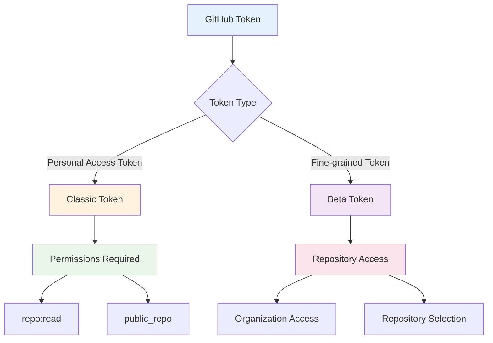
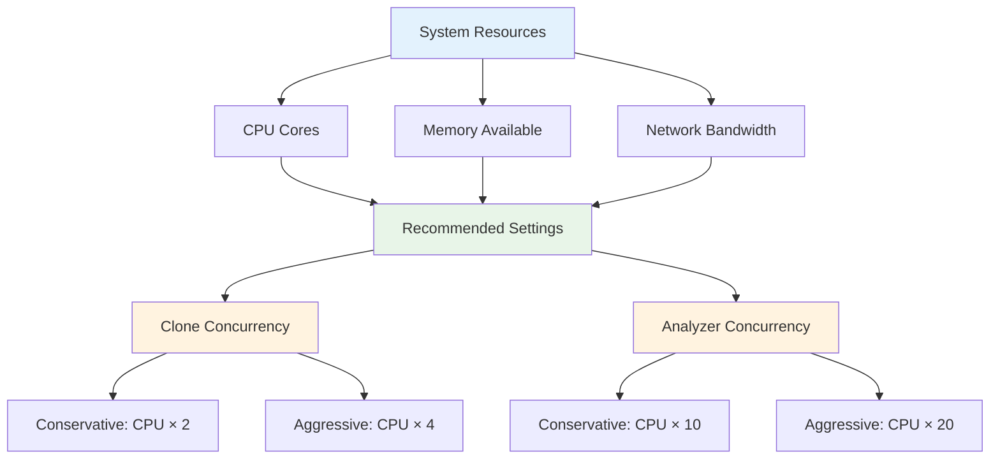
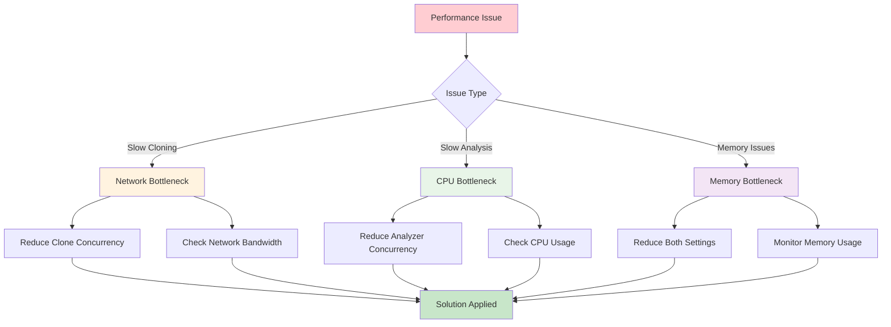

# tf-analyzer Configuration Guide

This document provides comprehensive information about configuring tf-analyzer for optimal performance and customization.

## Configuration Overview

tf-analyzer uses environment variables for configuration, providing flexibility for different deployment scenarios. Configuration can be provided through:

1. **Environment Variables** - Direct system environment variables
2. **`.env` File** - Local environment file (recommended for development)
3. **System Environment** - Container or system-level configuration

## Environment Variables

### Required Configuration

| Variable | Description | Example | Required |
|----------|-------------|---------|----------|
| `GITHUB_TOKEN` | GitHub personal access token for API authentication | `ghp_xxxxxxxxxxxxxxxxxxxx` | ✅ |
| `GITHUB_ORGS` | Comma-separated list of GitHub organizations to analyze | `hashicorp,terraform-providers` | ✅ |

### Optional Configuration

| Variable | Default | Description | Example |
|----------|---------|-------------|---------|
| `GITHUB_BASE_URL` | *(empty)* | Custom GitHub Enterprise base URL | `https://git.company.com/api/v3` |
| `MAX_CONCURRENT_CLONES` | `100` | Maximum concurrent git clone operations | `50` |
| `MAX_CONCURRENT_ANALYZERS` | `100` | Maximum concurrent file analysis operations | `200` |

## Detailed Configuration

### GitHub Authentication



#### Creating a GitHub Token

1. **Navigate to GitHub Settings**:
   - Go to [GitHub Settings > Developer settings > Personal access tokens](https://github.com/settings/tokens)

2. **Generate New Token**:
   ```bash
   # Classic tokens (recommended)
   - Select "Generate new token (classic)"
   - Set expiration (90 days recommended for security)
   - Select scopes: repo, read:org, read:user
   ```

3. **Fine-grained Tokens** (Beta):
   ```bash
   # For specific organizations
   - Select "Generate new token (beta)"
   - Choose resource owner (organization)
   - Select repository access
   - Set permissions: Contents (read), Metadata (read)
   ```

#### Required Permissions

| Scope | Classic Token | Fine-grained | Purpose |
|-------|--------------|-------------|---------|
| `repo` | ✅ | N/A | Full repository access (private repos) |
| `public_repo` | ✅ | N/A | Public repository access only |
| `read:org` | ✅ | N/A | Organization membership access |
| `Contents` | N/A | ✅ | Repository content access |
| `Metadata` | N/A | ✅ | Repository metadata access |

### GitHub Enterprise Configuration

For GitHub Enterprise deployments:

```bash
# Example for GitHub Enterprise Server
GITHUB_BASE_URL=https://git.company.com/api/v3
GITHUB_TOKEN=your_enterprise_token
GITHUB_ORGS=internal-org,platform-team
```

### Performance Configuration

#### Concurrency Settings



#### Performance Tuning Guidelines

| System Type | Clone Concurrency | Analyzer Concurrency | Memory Usage |
|-------------|-------------------|---------------------|--------------|
| **Development** (4 cores, 8GB RAM) | `10-20` | `50-100` | ~2-4GB |
| **CI/CD** (8 cores, 16GB RAM) | `25-50` | `100-200` | ~4-8GB |
| **Production** (16+ cores, 32GB+ RAM) | `50-100` | `200-500` | ~8-16GB |

#### Optimization Strategies

1. **Network-Bound Workloads**:
   ```bash
   # Reduce clone concurrency, increase analyzer concurrency
   MAX_CONCURRENT_CLONES=25
   MAX_CONCURRENT_ANALYZERS=200
   ```

2. **CPU-Bound Workloads**:
   ```bash
   # Balance both settings
   MAX_CONCURRENT_CLONES=50
   MAX_CONCURRENT_ANALYZERS=100
   ```

3. **Memory-Constrained Systems**:
   ```bash
   # Conservative settings
   MAX_CONCURRENT_CLONES=10
   MAX_CONCURRENT_ANALYZERS=50
   ```

## Configuration Examples

### Development Environment

```bash
# .env file for local development
GITHUB_TOKEN=ghp_xxxxxxxxxxxxxxxxxxxx
GITHUB_ORGS=hashicorp
MAX_CONCURRENT_CLONES=10
MAX_CONCURRENT_ANALYZERS=50
```

### CI/CD Pipeline

```yaml
# GitHub Actions example
env:
  GITHUB_TOKEN: ${{ secrets.GITHUB_TOKEN }}
  GITHUB_ORGS: "org1,org2,org3"
  MAX_CONCURRENT_CLONES: 25
  MAX_CONCURRENT_ANALYZERS: 100
```

### Production Deployment

```bash
# Docker environment
GITHUB_TOKEN=${GITHUB_TOKEN}
GITHUB_ORGS=hashicorp,terraform-providers,gruntwork-io
MAX_CONCURRENT_CLONES=100
MAX_CONCURRENT_ANALYZERS=300
GITHUB_BASE_URL=https://git.enterprise.com/api/v3
```

### Multi-Organization Analysis

```bash
# Large-scale analysis
GITHUB_ORGS=hashicorp,terraform-providers,gruntwork-io,cloudposse,antonbabenko
MAX_CONCURRENT_CLONES=75
MAX_CONCURRENT_ANALYZERS=250
```

## Internal Configuration (Code-Level)

The following settings are configured in the code and can be modified by editing `ghorg_wrapper.go`:

### ghorg Command Configuration

```go
// Current settings in buildGhorgCommand()
args = append(args, "--skip-archived")    // Skip archived repositories
args = append(args, "--git-filter", "blob:none")  // Lightweight clones
```

#### Available ghorg Options

| Flag | Current Setting | Purpose | Modifiable |
|------|----------------|---------|-----------|
| `--skip-archived` | ✅ Enabled | Skip archived repositories | ✅ |
| `--skip-forks` | ❌ Disabled | Skip forked repositories | ✅ |
| `--git-filter` | `blob:none` | Partial clone for speed | ✅ |
| `--concurrency` | From config | Clone operation concurrency | ✅ |

### Timeout Configuration

```go
// Default timeout settings
ProcessTimeout: 30 * time.Minute  // Overall process timeout
```

### File Processing Configuration

```go
// File types processed (isRelevantFile function)
Supported Extensions:
- .tf       (Terraform files)
- .tfvars   (Terraform variables)
- .hcl      (HashiCorp Configuration Language)
- .md       (Markdown documentation)
- .markdown (Markdown documentation)
```

## Advanced Configuration

### Custom File Extensions

To modify which files are analyzed, edit the `isRelevantFile` function:

```go
func isRelevantFile(path string) bool {
    lower := strings.ToLower(path)
    return strings.HasSuffix(lower, ".tf") ||
           strings.HasSuffix(lower, ".tfvars") ||
           strings.HasSuffix(lower, ".hcl") ||
           strings.HasSuffix(lower, ".md") ||
           strings.HasSuffix(lower, ".yaml") ||    // Add YAML support
           strings.HasSuffix(lower, ".yml")        // Add YML support
}
```

### Custom Clone Directory

The application uses `~/src/gh-repos-clone` as the base directory. To modify:

```go
// In createTempDirectory function
baseDir := "~/src/custom-clone-dir"  // Modify this path
```

### ghorg Configuration File

Create `~/.config/ghorg/conf.yaml` for advanced ghorg settings:

```yaml
# Example ghorg configuration
scm: github
protocol: https
concurrency: 25
skip-archived: true
skip-forks: false
git-filter: "blob:none"
clone-type: org
```

## Monitoring and Debugging

### Log Output Configuration

The application provides detailed logging. Key metrics include:

- **Organization Processing**: Progress through organization list
- **Repository Discovery**: Number of repositories found per organization
- **Processing Statistics**: Success/failure rates, file counts, timing
- **Error Reporting**: Detailed error messages for troubleshooting

### Performance Monitoring

Monitor these metrics during execution:

```bash
# System resource usage
htop          # CPU and memory usage
iotop         # Disk I/O monitoring
nethogs       # Network usage per process

# Application metrics (from log output)
- Repositories processed per minute
- Files analyzed per second
- Memory usage growth
- Error rates by organization
```

## Troubleshooting

### Common Configuration Issues

| Issue | Symptom | Solution |
|-------|---------|----------|
| **Invalid Token** | `Authentication failed` | Verify token permissions and expiration |
| **Rate Limiting** | `API rate limit exceeded` | Reduce concurrency or use GitHub App token |
| **Network Timeouts** | `Clone failed: timeout` | Reduce `MAX_CONCURRENT_CLONES` |
| **Memory Issues** | `Out of memory` | Reduce `MAX_CONCURRENT_ANALYZERS` |
| **No Organizations** | `No repositories found` | Verify organization names and access |

### Performance Troubleshooting



### Debug Mode

Enable detailed logging by modifying the `logProgress` function or setting verbosity:

```go
// Add debug logging
if debugMode {
    logProgress("Debug: Processing repo %s", repo.Name)
}
```

## Security Considerations

### Token Security

1. **Never commit tokens** to version control
2. **Use environment variables** for token storage
3. **Rotate tokens regularly** (every 90 days recommended)
4. **Use minimal permissions** required for operation
5. **Consider GitHub Apps** for production deployments

### Network Security

```bash
# For corporate environments
export HTTPS_PROXY=https://proxy.company.com:8080
export HTTP_PROXY=http://proxy.company.com:8080
export NO_PROXY=localhost,127.0.0.1,.company.com
```

### Data Handling

- **Temporary files** are cleaned up automatically
- **Repository data** is stored temporarily in `~/src/gh-repos-clone`
- **No persistent storage** of repository contents
- **Memory-only analysis** of file contents

## Configuration Validation

The application validates configuration at startup:

```go
// Validation checks performed
- MaxGoroutines > 0
- CloneConcurrency > 0  
- GitHubToken is not empty
- At least one organization specified
```

For additional configuration support, refer to the [ghorg documentation](https://github.com/gabrie30/ghorg) for underlying clone operation options.