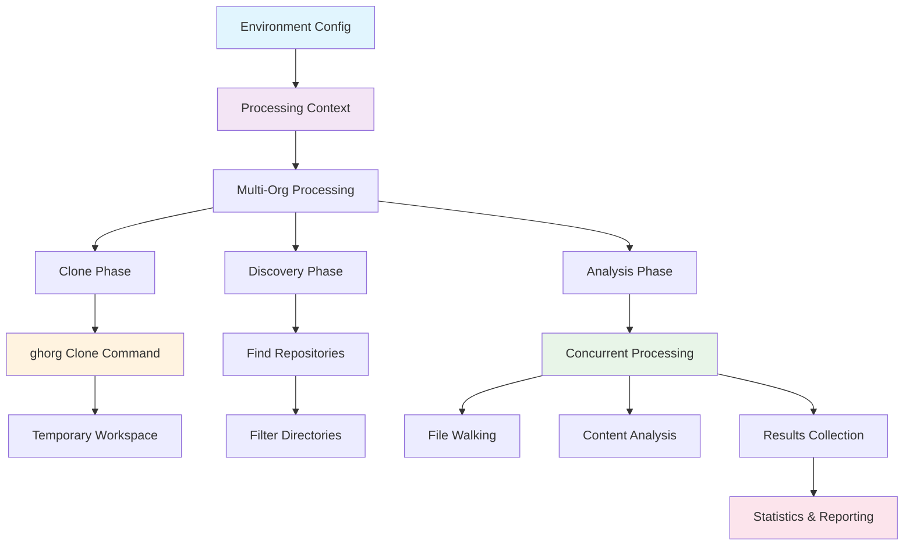
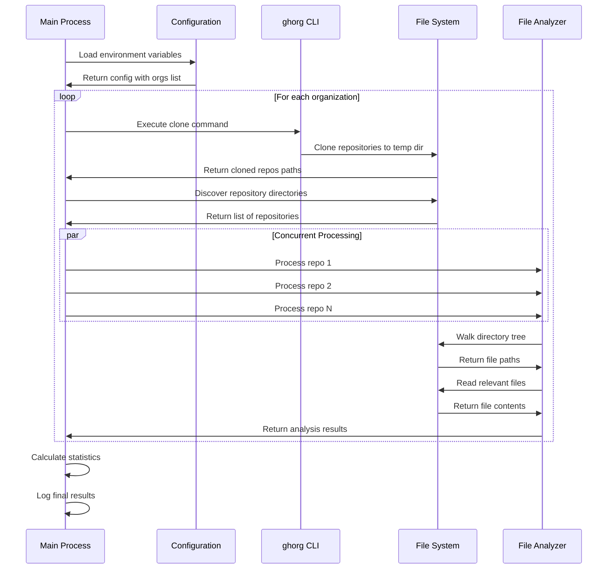
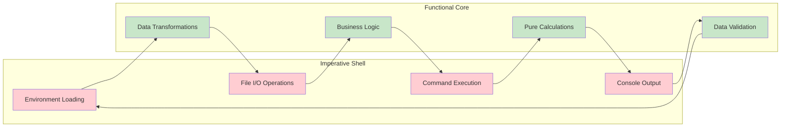

# tf-analyzer

A high-performance Go application for concurrently cloning multiple GitHub organizations and analyzing their Terraform, HCL, and Markdown files in real-time.

## Overview

tf-analyzer is designed to efficiently discover, clone, and analyze Infrastructure as Code (IaC) files across entire GitHub organizations. It focuses on parsing markdown (.md), HCL (.hcl), Terraform (.tf), and tfvars files with maximum speed while maintaining clean, functional programming principles.

## Key Features

- **Concurrent Organization Processing**: Clone multiple GitHub organizations simultaneously
- **High-Performance File Analysis**: Process thousands of repositories with configurable concurrency
- **Smart File Filtering**: Automatically identifies and processes relevant IaC files
- **Functional Architecture**: Built with pure functions and immutable data structures
- **Real-time Progress Tracking**: Live updates on processing status and statistics
- **AWS Resource Detection**: Identifies Terraform files containing AWS resources
- **Memory Efficient**: Uses git's blob filtering for lightweight clones

## Architecture Overview



## Core Workflow



## Quick Start

### Prerequisites

1. **Go 1.21+** - [Install Go](https://golang.org/doc/install)
2. **ghorg** - GitHub organization cloning tool
   ```bash
   # Install ghorg
   go install github.com/gabrie30/ghorg@latest
   ```
3. **GitHub Token** - [Create a personal access token](https://github.com/settings/tokens)

### Installation

```bash
# Clone the repository
git clone <repository-url>
cd tf-analyzer

# Install dependencies
go mod download

# Build the application
make build
```

### Basic Usage

1. **Create environment file**:
   ```bash
   cp .env.example .env
   ```

2. **Configure environment variables**:
   ```bash
   # Required
   GITHUB_TOKEN=your_github_token_here
   GITHUB_ORGS=hashicorp,terraform-providers,gruntwork-io
   
   # Optional
   MAX_CONCURRENT_CLONES=100
   MAX_CONCURRENT_ANALYZERS=100
   ```

3. **Run the analyzer**:
   ```bash
   make run
   ```

## Functional Programming Architecture

The codebase follows the **"Functional Core, Imperative Shell"** pattern:



### Code Organization

1. **Data Structures** (Lines 24-78): Pure data types with no behavior
2. **Calculations** (Lines 84-243): Pure functions for business logic
3. **Actions** (Lines 249-395): Impure functions for I/O operations
4. **Orchestration** (Lines 401-825): Workflow coordination

## Performance Characteristics

- **Concurrency**: Configurable goroutine pools for optimal resource usage
- **Memory Efficiency**: Streaming file processing with minimal memory footprint
- **Network Optimization**: Uses git's `--filter=blob:none` for faster clones
- **Error Resilience**: Continues processing even if individual repositories fail

## Dependencies

- **[ghorg](https://github.com/gabrie30/ghorg)** - GitHub organization cloning tool
- **[samber/lo](https://github.com/samber/lo)** - Functional programming utilities
- **[panjf2000/ants](https://github.com/panjf2000/ants)** - High-performance goroutine pool
- **[sourcegraph/conc](https://github.com/sourcegraph/conc)** - Better structured concurrency
- **[joho/godotenv](https://github.com/joho/godotenv)** - Environment variable loading

## Development

### Available Commands

```bash
# Build and test
make build          # Build the application
make test           # Run all tests
make lint           # Run golangci-lint
make ci             # Run full CI pipeline

# Development
make run            # Run the application
make deps           # Download dependencies
make coverage       # Generate coverage report

# Quality assurance
make lint-fix       # Auto-fix linting issues
make sec            # Run security checks
make bench          # Run benchmarks
```

### Code Quality Standards

- **Function Complexity**: Maximum cyclomatic complexity of 8
- **Function Length**: Limited to 25 lines
- **Test Coverage**: 100% coverage requirement
- **Pure Functions**: No side effects in business logic
- **Type Safety**: Comprehensive error handling

## Configuration

For detailed configuration options, see [CONFIG.md](CONFIG.md).

## Contributing

1. Follow the functional programming principles outlined in `CLAUDE.md`
2. Ensure all tests pass: `make ci`
3. Maintain 100% test coverage
4. Keep functions under 25 lines with complexity ≤ 8
5. Use descriptive variable names and avoid abbreviations

## License

[Add your license here]

## Related Projects

- **[ghorg](https://github.com/gabrie30/ghorg)** - The core cloning engine
- **[Terraform](https://www.terraform.io/)** - Infrastructure as Code tool
- **[HashiCorp Configuration Language](https://github.com/hashicorp/hcl)** - HCL parser and toolkit